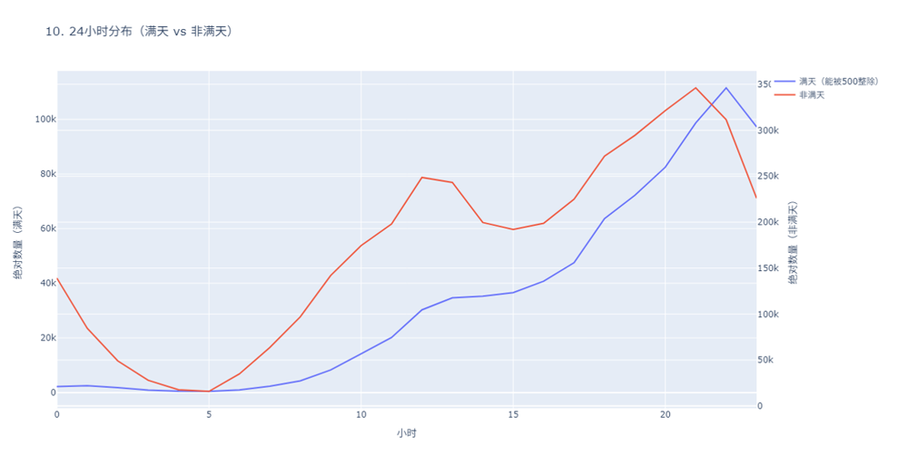
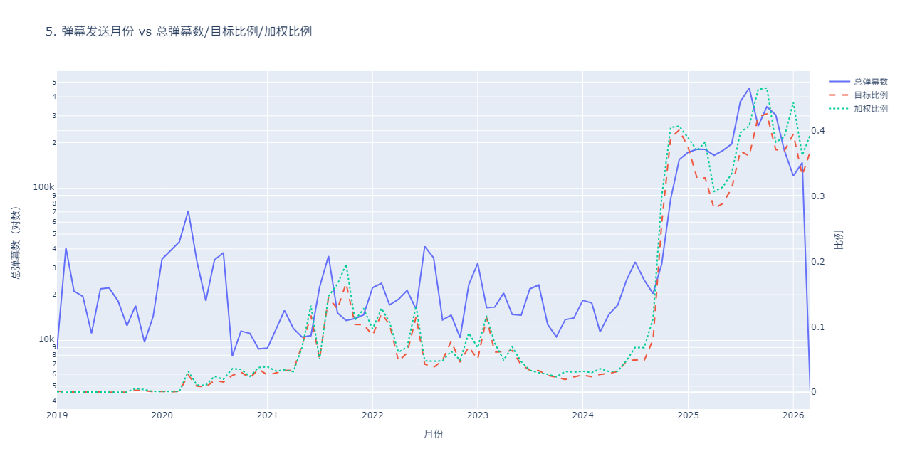
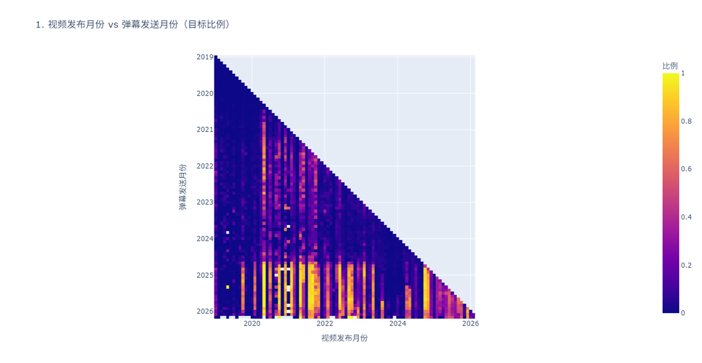
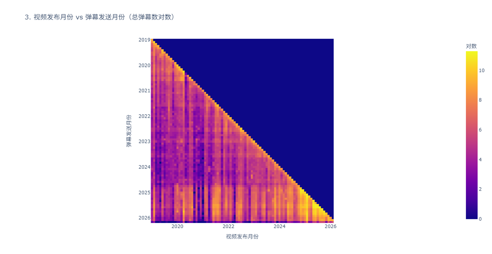
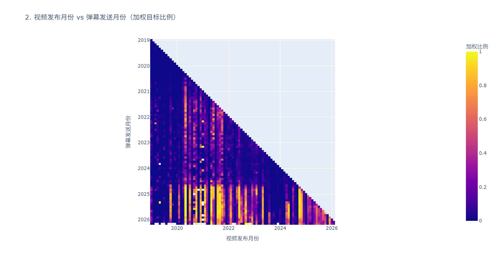
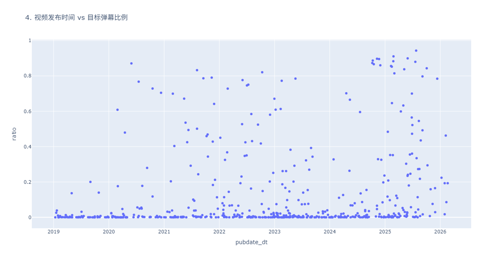
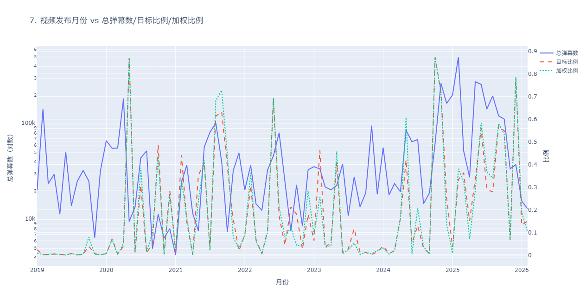
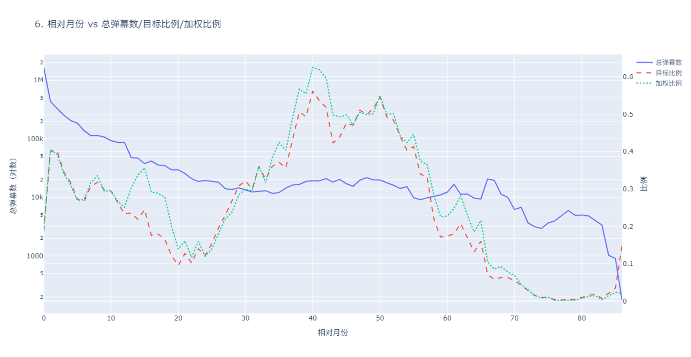
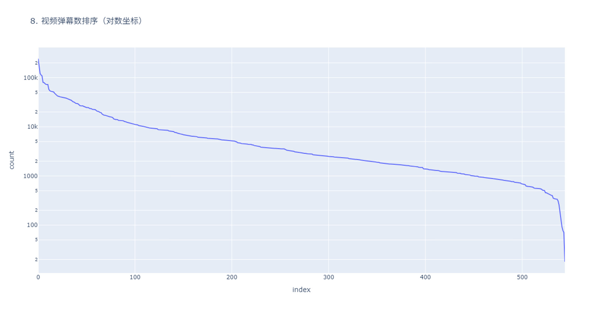
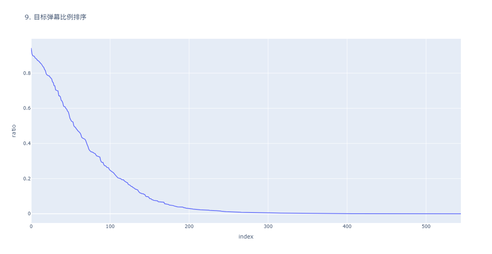

在术力口视频中，常常有大量「kksk」的弹幕。在我的印象里，前几年 B 站这种弹幕还没有这么多。但也有人认为前几年更多，现在已经变少了。

那么，「kksk」弹幕在术力口视频中，是否随时间而变多？我做了个统计，统计此类弹幕的趋势。

先说结论，根据获取的 546 个视频总共 493 万条弹幕的数据，按弹幕发布时间看，**在 2024 年秋季，总弹幕数与 kksk 弹幕占比都突然上升**，具体原因未知。既不是逐渐上升，也不是逐渐下降，非常神奇！而按视频发布时间则看不出明显的规律。

由于我不懂统计学，只好让 AI 写代码画几张图，肉眼看看有没有规律，难以进一步分析。若您对此感兴趣，欢迎交流讨论。

## 背景

- [「kksk」](https://mzh.moegirl.org.cn/%E8%BF%99%E9%87%8C%E5%96%9C%E6%AC%A2)是「ここすき」的缩写，意为「喜欢这里」，是 Niconico 的弹幕用语，在 B 站上也流行。
- [「术力口」](https://mzh.moegirl.org.cn/VOCALOID)是「ボカロ」的借形，即歌声合成软件「VOCALOID」，但在此泛指各种歌声合成软件及其合成的歌曲

## 视频

我统计的视频取自取自[萌娘百科](https://mzh.moegirl.org.cn/VOCALOID%E4%B8%AD%E6%96%87%E4%BC%A0%E8%AF%B4%E6%9B%B2)中 2019 年及以后的 B 站传说曲、神话曲列表，引擎包括 VOCALOID（中文外文皆有）、UTAU、SV、ACE。只统计了萌娘百科列出的视频，也没有包括播放量更少的殿堂曲、2019 年以前的视频，以减少数据量、节省时间。

需要说明，数据的获取都是在三月份完成的，只因我比较懒，所以迟迟没有进一步处理。因此，三月份以后萌娘百科新增的视频也没有涵盖。此外，列表中有部分视频已经下架，当然也无法统计。

## 弹幕

B 站有两种弹幕池，一种是实时弹幕，一种是历史弹幕。二者能容纳的总量都有上限。

据我所知，实时弹幕上限较高（通常有数千），但实时更新，无法获取旧的弹幕；而历史弹幕虽单天的上限较低（大多不超过一千），但每天都相互独立，一天满了不影响另一天，故总量较高，只是需要逐天获取。实时弹幕中的许多弹幕在历史弹幕中找不到，反之亦然。不过，实时弹幕每次获取到的都会有许多不同，而历史弹幕多次获取之间差异极小。此外，历史弹幕在满天时晚上的弹幕明显比早上多（如下图），我猜测它总是保留最新弹幕；而实时弹幕保留哪些似乎就没有规律。总而言之，历史弹幕总量大、比较稳定，所以我获取的是历史弹幕。我只获取了三月份之前的弹幕。

判断弹幕是不是「kksk」的条件为：弹幕仅由一个或多个「kksk」组成，其间仅有或没有空格。

## 结果

下面的折线图可以看出各个时间发送的弹幕总量以及「kksk」在弹幕中的占比。很容易发现，在 2024 年秋天，总弹幕数与「kksk」占比都突然上升。其中「加权比例」是把弹幕按其所在的视频的总弹幕数的反比加权，以避免弹幕数过多的视频影响大局。

接下来这张热图展示了不同时间发布的视频中各个时间发送的弹幕中「kksk」占比有多少。也可以明显看出 2024 年秋天「kksk」的占比增加，几乎把图像分成了上下两半。而视频发布月份看不出什么规律。

下面又是一张热图，只不过是总弹幕数而非「kksk」占比的。同样能看出 2024 年秋天的弹幕数量增加。此外还能看到一些横条，我认为主要是寒暑假引起的弹幕数量增加。

剩下几张不那么重要的图表。

这张加权比例的热图，和普通的占比没有什么区别。

这张视频发布时间与目标弹幕比例的散点图，可以看出大部分视频的「kksk」弹幕其实并不多，但占比极高的也有。

下面是视频发布时间的折线图。发布时间似乎与弹幕数和「kksk」占比没啥关系。

这张是相对月份的（也就是弹幕发送时间减去视频发布时间），我看不出体现了什么信息。

下面是按照视频弹幕数排序。

最后一张是目标弹幕占比排序。

## 更多问题

最后，还有许多尚未解决的问题。

- 关键问题：为何 2024 年秋季，弹幕总量、「kksk」占比都突然增加？是否只是 B 站修改了保留弹幕的逻辑导致的误差，还是有什么深层原因？
- 其他弹幕内容（例如表达鼓掌含义的 888，我感觉近期也有增加）是否也有此现象？
- 实时弹幕是否有此现象？
- 除了时间之外，是否还有哪些视频或弹幕的信息与弹幕内容相关？
- 其他相关视频，例如发布时间更早的、播放量更少的、没有被萌娘百科收录的，甚至不属于歌曲的视频，是否有这一现象？

这些问题我无力解决，希望各位有志之士给予帮助，也欢迎大家交流讨论。
