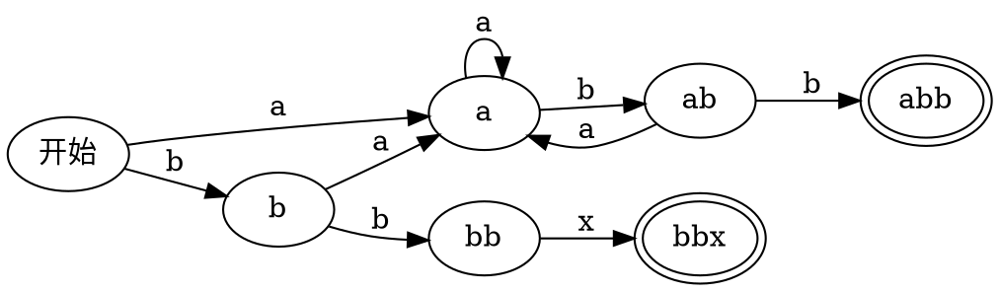
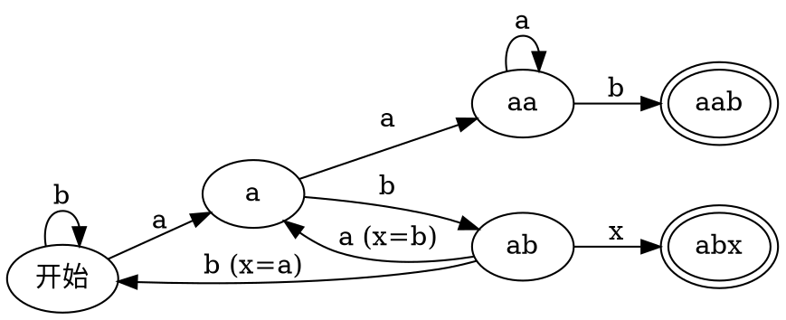

看到一个小游戏：

- 一副扑克牌，只看颜色（红或黑）。
- 甲选三张牌，有序地排成一串（如「红红红」）。
- 乙看了之后也选三张排成一串，要和甲不同（当然，对称算不同的）。
- 洗牌，抽牌，一张张排过去，排成一串。排的时候，若出现了甲选的三种，则甲胜；若出现了乙的，则乙胜。实际上，就是看最后抽的三张牌的颜色是否与甲或乙选的相同，相同则结束。

看起来，乙是有优势的（除了一种情况：甲把最好的选法选走了，乙没得选。事实上永远不会发生这种情况）。那么，乙该如何选才能发挥优势，使胜率最高？

我写了代码（在文末），观察出规律。乙最好的选择为：甲的选择去掉最后一张，并在开头加上与甲选择的倒数第二个不同的颜色。也就是说，若甲选了 $xyz$，则乙应当选 $\overline{y}xy$（上划线代表不同的颜色，不同的字母颜色可以相同）。

不难说明，乙采取这种选法时，胜率总是比甲大。可以分情况画出自动机（其中 a 和 b 代表不同的颜色，具体是啥颜色不重要）。

甲选的前两个相同的情况。抽第一张牌后，到 a 和 b 两个节点的概率相同。但到 a 后一定乙胜，而到 b 后甲依然可能胜利（有一条 b 到 a 的边）。



甲选的前两个不同的情况。抽到 a 后再抽一张牌，此时到 aa 和 ab 两个节点的概率相同。但到 aa 后一定乙胜，而到 b 后甲依然可能胜利（有两条边根据 x 为 a 或 b 的两种情况来选，都可能导致甲胜）。



值得一提的是，如果要选四张牌，那么这个选法大部分情况下也是最优的。唯一的例外是甲选择「abab」，此时乙应该选「aaba」而非「baba」，后者显然会打平手。

如何证明这种选法是最优的？这个问题有没有更本质的做法？如何推广到选更多牌的情况？我没有能力解决，但这个问题在很久以前以硬币的形式流行过：[两个人连续投一枚硬币，如果先出现“正正反”则甲胜，如果先出现“正反反”则乙胜，两人获胜概率是否一样？ - 知乎](https://www.zhihu.com/question/584880907)。

寻找发现 Matrix67 也写过一篇文章，介绍了一般形式的这种问题，叫作[**{彭尼的游戏|Penney's game}**](https://zh.wikipedia.org/wiki/%E5%BD%AD%E5%B0%BC%E7%9A%84%E6%B8%B8%E6%88%8F)：[Penney 的游戏：正所谓后发制人，先发制于人 | Matrix67: The Aha Moments](https://matrix67.com/blog/archives/6015)。其中不考虑扑克牌有限这种问题。有如下结论：

- 选三张牌时，这种选法确实是最优的。
- 选更多牌时，乙最好的选择同样是要把甲的选择去掉最后一个，但开头加的就不一定了，没有明显规律。
- 选 n 张牌时，乙最好选择的胜率不低于 $\frac{2 - 2^{1-n}}{3}$。选一张或两张牌时，甲的最好选择会导致双方胜率相同。
- 这是[非传递博弈](https://zh.wikipedia.org/wiki/%E9%9D%9E%E4%BC%A0%E9%80%92%E5%8D%9A%E5%BC%88)。会出现：选择 A 和选择 B 对决时胜率高，B 和选择 C 比较胜率也高，而 C 和 A 比较胜率还高。

以下是代码，会输出两个表格。第一个的内容是该行的选择对上该列的选择的胜率；第二个的第一列是甲的选择，后面是乙最好的三种选择及其胜率。做了缓存，相反和交换结果不变。

```ts
const 全 = '000,001,010,011,100,101,110,111'.split(',')

const 随机 = () => Math.random() > 0.5 ? '1' : '0'
const 一轮 = (我: string, 你: string) => {
  let a = 随机(), b = 随机(), c = 随机()
  while (true) {
    switch (a + b + c) {
      case 我: return 1
      case 你: return 0
    }
    [a, b, c] = [b, c, 随机()]
  }
}

const 反 = (式: string) => String(111111 - +式).padStart(6, '0')
const 缓存: Record<string, number> = {}
const 轮 = 10_0000
const 我的胜率 = (我: string, 你: string) => {
  if (我 === 你) return 0.5
  const c = 缓存[我 + 你] || 1 - 缓存[你 + 我] || 缓存[反(我 + 你)] || 1 - 缓存[反(你 + 我)]
  if (c) return c
  let 胜 = 0
  for (let i = 0; i < 轮; i++) 胜 += 一轮(我, 你)
  return 缓存[我 + 你] = 胜 / 轮
}

console.table(Object.fromEntries(全.map(我 => [我,
  Object.fromEntries(全.map(你 =>
    [你, `${(我的胜率(我, 你) * 100).toFixed(2)}%`]))
])))

console.table(Object.fromEntries(全.map(你 => {
  const 我 = 全.slice().sort((我1, 我2) => 我的胜率(我2, 你) - 我的胜率(我1, 你))
  return [你, 我.slice(0, 3).flatMap(我 => [我, `${(我的胜率(我, 你) * 100).toFixed(2)}%`])]
})))
```