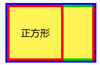
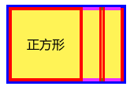
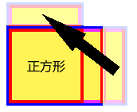
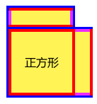
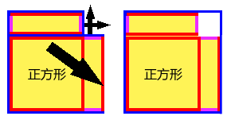
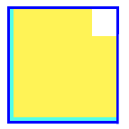

## 矩形周长不变面积最大

看到一个B站视频：<https://www.bilibili.com/video/BV1yY4y187m5>

> 周长相同的矩形之中，为何正方形面积最大？

----

想到一个没有代数的解释方法：

以下，相同长度的边用相同颜色标记；但蓝色表示原有长方形的周长；黄色的区域表示原有长方形的面积。

有一个矩形，将其切成两部分，有一部分是最大的正方形。

将其中不一定是正方形的部分，竖着切成两份，平均分。

 

将一个长方形移到正方形上面。  
重合的边，长度必须相同。

将蓝边平移或旋转。  
经此操作，蓝边长度不变。蓝边长度的总和就是矩形的周长。

现在，将一些标记删掉。  
等量加等量还是等量，把“红边+紫边”看作浅蓝边。

原长方形的周长组成了一个新的矩形。  
从长、宽相等可以看出，这个新矩形是正方形。  
也就是，**周长相同的正方形**。

同时，原长方形的面积（黄色区域）无法填满新矩形。  
整体大于部分，因此**新矩形的面积大于原长方形**。

接着，由于最开始我们使用的长方形没有规定，因此**任意一个长方形都满足这些条件**。

因此：

> 任意一个的长方形，其面积，不大于与其周长相同的正方形的面积。

由此得出（这一步感觉有点漏洞，希望提出）：

> 一个正方形，其面积不小于任何与其周长相同的长方形。

也就是（这一步感觉也有点漏洞，希望提出）：

> 周长相同的矩形之中，正方形面积最大。