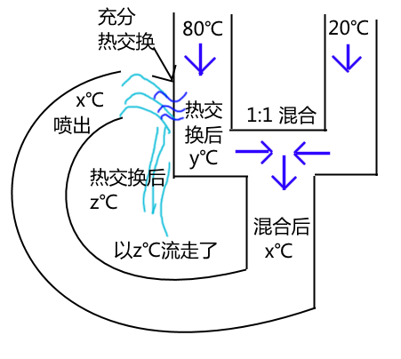

题目：<https://www.bilibili.com/video/BV14341147iN>

如上图，求x。

当然，是理想条件下，因此作出以下假设：

1. 最初出水管（20℃、80℃）匀速且速度相同。
1. 混合保证平均且充分。
1. 混合、流动等均不会损失能量。
1. 热交换充分（虽然现实中不可能）。

----

想到解题办法了吗？  
这里我说一种非常简洁的方法。

- 将整个系统看做黑盒，由于能量守恒，最终输出的温度必定是输入温度的平均。  
则$z = \frac{80 + 20}{2} = 50$
- 同时因为热交换，易得$y = z = 50$
- 于是经过混合，$x = \frac{y + 20}{2} = 35$

完毕。

另外，类似地，从喷出水后的热交换看，$\frac{80 + 2x}{3} = y$，同样$x = 35$。  
需要加权平均，因为喷出的水量是热水管内的二倍。

----

这应该是条件相同的情况下最简单的方法了。